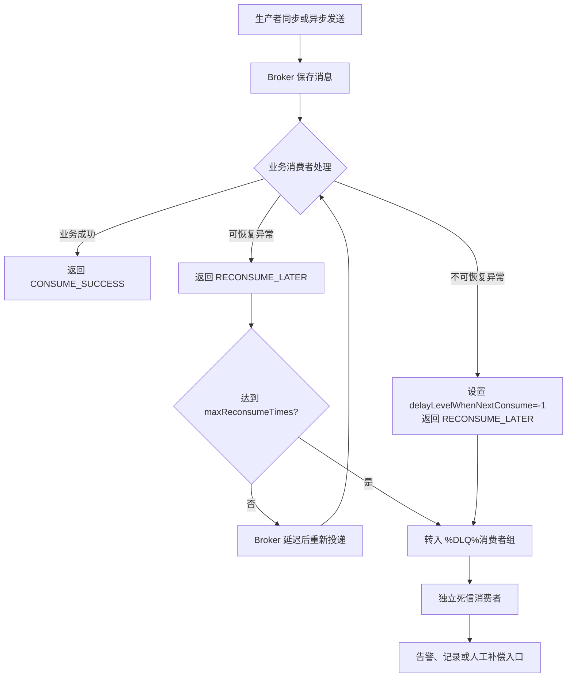

# 06 RocketMQ 消费重试与死信队列

## 学习目标与边界

本章使用 RocketMQ Client 4.9.2 演示：

1. 生产者同步、异步发送失败重试配置。
2. 消费者前两次失败、第三次成功，并观察 `reconsumeTimes`。
3. 可恢复异常持续失败，超过最大重试次数后进入死信队列（DLQ）。
4. 不可恢复异常不做无意义重试，直接交给 Broker 转入 DLQ。
5. 独立消费者订阅 `%DLQ%消费者组`，作为告警和人工补偿入口。
6. 只有业务真正成功时才返回 `CONSUME_SUCCESS`。

**本章暂不实现重复消费幂等和 Spring Boot 集成，它们留给后续章节。**

## 模块结构

```text
retrydlq/
├── config/
│   └── RetryAndDlqConfig.java             # NameServer、Topic、组名和重试参数
├── consumer/
│   ├── RecoverableRetryConsumer.java      # 前两次失败、第三次成功
│   ├── AlwaysFailingConsumer.java         # 持续失败或不可恢复失败
│   └── DeadLetterConsumer.java            # 独立订阅死信 Topic
├── exception/
│   ├── RecoverableBusinessException.java  # 可恢复业务异常
│   └── UnrecoverableBusinessException.java# 不可恢复业务异常
├── model/
│   └── FailureType.java                   # 失败类型
├── producer/
│   └── RetryMessageProducer.java          # 同步/异步发送重试
├── service/
│   └── RetryBusinessService.java          # 演示用业务规则
└── support/
    ├── ConsumerLifecycle.java             # 消费者生命周期
    └── MessageSupport.java                # 消息构建与日志
```

## 核心概念

### ==1、生产者重试与消费者重试不是一回事==

| 类型 | 触发阶段 | 配置/返回值 | 解决的问题 |
| --- | --- | --- | --- |
| 同步发送重试 | Producer 到 Broker 发送失败 | `setRetryTimesWhenSendFailed` | 网络抖动、Broker 暂时不可用等发送故障 |
| 异步发送重试 | Producer 异步发送失败 | `setRetryTimesWhenSendAsyncFailed` | 异步发送过程中的可重试故障 |
| 消费重试 | 消息已在 Broker，业务消费失败 | `RECONSUME_LATER` | 下游暂时不可用等业务处理故障 |
| 死信 | 消费持续失败或明确不可恢复 | `%DLQ%ConsumerGroup` | 隔离无法正常处理的消息 |

==发送重试次数表示客户端在一次发送调用中的额外尝试次数，不等价于业务消费次数==，也不能替代业务补偿。

### 2、`reconsumeTimes` 如何计数

首次投递时 `reconsumeTimes=0`，第一次重新投递为 `1`，第二次重新投递为 `2`。因此本章设置 `maxReconsumeTimes=2` 时，一条消息最多可观察到三次业务处理：首次投递加两次重新投递。

## 流程图



## 前置条件

- NameServer 默认地址：`127.0.0.1:9876`。
- Broker 已注册到 NameServer。
- Broker 开启 `autoCreateTopicEnable=true`，或已创建 `StudyRetryAndDlqTopic`。
- 本机能够访问 Broker 注册的 `brokerIP1`。
- DLQ Topic 可能需要读取权限；若订阅失败，请检查 Broker ACL、Topic 权限与当前 RocketMQ 部署方式。

可通过 JVM 系统属性或环境变量覆盖配置。常用系统属性如下：

```text
-Drocketmq.namesrvAddr=127.0.0.1:9876
-Drocketmq.retry.topic=StudyRetryAndDlqTopic
-Drocketmq.retry.maxReconsumeTimes=2
-Drocketmq.retry.syncTimes=3
-Drocketmq.retry.asyncTimes=3
-Drocketmq.retry.sendTimeoutMillis=3000
```

## 运行顺序

以下命令均在项目根目录执行。消费者是长驻进程，建议分别打开终端。

### 场景一：前两次失败、第三次成功

1. 启动消费者：

```powershell
mvn -q -pl 06-rocketmq-retry-and-dlq exec:java `
  -Dexec.mainClass=com.example.rocketmqstudy.retrydlq.consumer.RecoverableRetryConsumer
```

2. 同步发送 `success` 场景消息：

```powershell
mvn -q -pl 06-rocketmq-retry-and-dlq exec:java `
  -Dexec.mainClass=com.example.rocketmqstudy.retrydlq.producer.RetryMessageProducer `
  -Dexec.args="sync success"
```

### 场景二：可恢复异常持续失败后进入 DLQ

1. 启动死信消费者：

```powershell
mvn -q -pl 06-rocketmq-retry-and-dlq exec:java `
  -Dexec.mainClass=com.example.rocketmqstudy.retrydlq.consumer.DeadLetterConsumer
```

2. 启动持续失败消费者：

```powershell
mvn -q -pl 06-rocketmq-retry-and-dlq exec:java `
  -Dexec.mainClass=com.example.rocketmqstudy.retrydlq.consumer.AlwaysFailingConsumer `
  -Dexec.args="recoverable"
```

3. 异步发送持续失败消息：

```powershell
mvn -q -pl 06-rocketmq-retry-and-dlq exec:java `
  -Dexec.mainClass=com.example.rocketmqstudy.retrydlq.producer.RetryMessageProducer `
  -Dexec.args="async recoverable"
```

### 场景三：不可恢复异常直接进入 DLQ

保持死信消费者运行，先将持续失败消费者改为不可恢复模式：

```powershell
mvn -q -pl 06-rocketmq-retry-and-dlq exec:java `
  -Dexec.mainClass=com.example.rocketmqstudy.retrydlq.consumer.AlwaysFailingConsumer `
  -Dexec.args="unrecoverable"
```

再发送不可恢复消息：

```powershell
mvn -q -pl 06-rocketmq-retry-and-dlq exec:java `
  -Dexec.mainClass=com.example.rocketmqstudy.retrydlq.producer.RetryMessageProducer `
  -Dexec.args="sync unrecoverable"
```

同一消费者组下不要同时运行 `recoverable` 与 `unrecoverable` 两种订阅表达式。RocketMQ 要求同一组消费者的订阅关系保持一致。

## 预期日志

### 第三次成功

```text
topic=StudyRetryAndDlqTopic, tag=RetrySuccess, ..., reconsumeTimes=0, ...
可恢复失败：模拟下游服务暂时不可用，reconsumeTimes=0，返回 RECONSUME_LATER
topic=StudyRetryAndDlqTopic, tag=RetrySuccess, ..., reconsumeTimes=1, ...
可恢复失败：模拟下游服务暂时不可用，reconsumeTimes=1，返回 RECONSUME_LATER
topic=StudyRetryAndDlqTopic, tag=RetrySuccess, ..., reconsumeTimes=2, ...
业务处理成功：第三次投递满足恢复条件
```

实际重试间隔由 Broker 的延迟级别控制，不会连续瞬时打印。

### 持续失败进入 DLQ

```text
可恢复但持续失败：模拟依赖服务持续不可用，reconsumeTimes=0，等待 Broker 重试
可恢复但持续失败：模拟依赖服务持续不可用，reconsumeTimes=1，等待 Broker 重试
可恢复但持续失败：模拟依赖服务持续不可用，reconsumeTimes=2，等待 Broker 重试
收到死信，进入告警/人工补偿入口：
topic=%DLQ%retry-dlq-consumer-group, ..., reconsumeTimes=0, ...
```

### 不可恢复异常

```text
不可恢复失败：模拟消息格式非法，重复执行也无法修复，直接进入 DLQ
收到死信，进入告警/人工补偿入口：
```

## 为什么失败时不能返回 `CONSUME_SUCCESS`

**==`CONSUME_SUCCESS` 是消费者对 Broker 的确认：这批消息已被正确处理，可以推进消费位点。==**若业务实际失败却返回成功，RocketMQ 不会再投递该消息，消息也不会自动进入 DLQ，等同于把业务失败静默丢弃。

正确原则是：

- 业务成功：返回 `CONSUME_SUCCESS`。
- 可恢复失败：返回 `RECONSUME_LATER`。
- 不可恢复失败：本例设置 `delayLevelWhenNextConsume=-1` 后仍返回 `RECONSUME_LATER`，由 Broker 转入 DLQ。
- ==**死信处理也只有在告警、记录或补偿入口真正接收成功后才返回 `CONSUME_SUCCESS`。**==

## 注意点

1. `setMaxReconsumeTimes(2)` 是最多重新消费两次，不是总共只处理两次。
2. 消费重试与 DLQ 只适用于==集群消费模式==；本例使用默认的 `CLUSTERING`。
3. 生产者重试可能把消息发送到其他 Broker，但不能保证解决所有网络故障；业务仍需面对发送结果不确定性。
4. `delayLevelWhenNextConsume=-1` 是 RocketMQ 4.x 客户端约定，本章固定使用 4.9.2；升级客户端时应重新核对行为。
5. **==DLQ 名称绑定产生失败消息的消费者组，而不是生产者组。==**本例为 `%DLQ%retry-dlq-consumer-group`。
6. 死信消息不会自动回到原 Topic；处理完成后是否重投需要业务侧明确设计，本章只打印并模拟补偿入口。
7. Listener 一次可能收到多条消息。本例逐条处理，但只要其中一条失败就返回整批失败，已处理消息可能再次投递；幂等将在后续章节解决。
8. 若修改消费者组，DLQ Topic 名称也会改变，死信消费者必须订阅新名称。
9. 为避免重复消费旧消息，反复练习时可修改消费者组，或使用管理工具重置消费位点。

## 常见问答

### 1. 什么是集群消费模式 `CLUSTERING`？

集群消费表示同一个消费者组内的多个消费者实例共同分摊消息。假设一个 Topic 有 4 个队列，同组有 3 个消费者实例，RocketMQ 会把队列分配给这些实例；同一条消息正常情况下只由组内一个实例处理。增加实例可以提高并发能力，但消费者数量超过队列数量后，多出的实例可能分不到队列。

不同消费者组之间相互独立。例如订单组和统计组都订阅同一个 Topic 时，同一条消息会分别交给两个组；但在每个组内部只分配给一个实例。

```text
订单 Topic
  ├── order-consumer-group
  │     ├── 实例 A
  │     └── 实例 B       # A、B 分摊消息
  └── statistics-consumer-group
        ├── 实例 C
        └── 实例 D       # C、D 再独立分摊一份消息
```

与之相对，广播消费 `BROADCASTING` 会让同组每个实例都收到每条消息。可以简单记忆：

- `CLUSTERING`：同组实例共同完成一份工作，消息在组内分摊。
- `BROADCASTING`：同组每个实例都完成一份工作，每个实例都收到消息。

本例没有调用 `setMessageModel`，因此使用默认的 `CLUSTERING`。RocketMQ 4.9.2 的自动消费重试和 DLQ 依赖消费者组维护重试状态与消费进度，主要适用于集群消费。

### 2. `delayLevelWhenNextConsume=-1` 是表示不再重试吗？

更准确地说，`-1` 表示不再进入普通的延迟重试流程，而是把本次消费失败的消息直接发送到当前消费者组的 DLQ。它既不是丢弃消息，也不是确认业务成功。

```text
返回 RECONSUME_LATER
  └── delayLevelWhenNextConsume=-1
        └── Broker 直接发送到 %DLQ%消费者组
```

因此本例处理不可恢复异常时仍然返回 `RECONSUME_LATER`。如果错误返回 `CONSUME_SUCCESS`，Broker 会认为业务已经成功，消息既不会重试，也不会进入 DLQ。

### 3. “一条失败导致整批失败”在当前 Demo 中如何体现？

Listener 接收的是 `List<MessageExt>`，当前代码会逐条处理；只要捕获到一条业务异常，就立即返回批次级的 `RECONSUME_LATER`：

```java
for (MessageExt message : messages) {
    try {
        businessService.processUntilThirdDelivery(message);
    } catch (RecoverableBusinessException exception) {
        return ConsumeConcurrentlyStatus.RECONSUME_LATER;
    }
}
return ConsumeConcurrentlyStatus.CONSUME_SUCCESS;
```

假设一次回调收到 `[A, B, C]`，A 已处理成功，B 处理失败，那么方法会直接返回，C 尚未处理。Listener 无法在这个返回值中表达“A 成功、B 失败、C 未处理”，RocketMQ 看到的是整个回调失败，因此这批消息可能被重新投递，A 也可能再次执行。

需要说明的是：本章当前没有调用 `setConsumeMessageBatchMaxSize`，生产者每次也只发送一条演示消息，所以实际运行三个场景时通常每次回调只有一条消息。现有代码体现了批次级返回值的风险，但没有专门复现“部分成功、整批重试”；该场景会在后续重复消费与幂等章节中单独演示。

### 4. 消费者组为 `order-consumer-group` 时，对应 DLQ Topic 是什么？

是 `%DLQ%order-consumer-group`。DLQ Topic 的固定命名规则是：

```text
%DLQ% + ConsumerGroup
```

DLQ 绑定的是产生消费失败的消费者组，不是生产者组。大小写和消费者组名称都必须完全一致。同一个消费者组消费多个业务 Topic 时，它们产生的死信可能进入同一个组级别的 DLQ Topic。

### 5. 死信消费者为什么最好使用独立消费者组？

需要区分“产生 DLQ 的原业务消费者组”和“负责处理 DLQ 的消费者组”：

```text
原业务消费者组 retry-dlq-consumer-group
  └── 持续失败后产生 Topic：%DLQ%retry-dlq-consumer-group
        └── 由独立处理组 retry-dlq-handler-group 订阅
```

使用独立处理组主要有四个原因：

1. 同一消费者组内的实例应该保持相同订阅关系；业务消费者订阅原 Topic、死信消费者订阅 DLQ，如果使用同一组会造成订阅关系不一致。
2. 正常业务消费进度和死信补偿进度应该隔离，便于分别重置位点和排查问题。
3. 死信处理本身也可能失败，独立组可以拥有自己的重试状态和失败边界。
4. 可以分别监控“业务消费失败量”和“死信补偿处理状态”，职责更清晰。

独立消费者组不会改变原 DLQ 名称。DLQ 名称仍由原业务消费者组决定，新的组只负责订阅和处理它。

### 6. 批量回调部分成功、部分失败时，为什么必须考虑幂等？

假设一次回调收到 `[A, B, C]`：

```text
A：扣减库存成功
B：调用下游失败
C：尚未处理
Listener：返回 RECONSUME_LATER
```

如果这一批被重新投递，A 会再次执行。没有幂等保护时，同一个订单可能重复扣库存、重复扣款、重复发券或重复增加积分。

幂等的目标不是阻止 RocketMQ 重新投递，而是保证同一条业务消息执行一次和执行多次的最终业务结果一致。例如使用订单号作为业务唯一键：第一次处理时执行扣库存并记录结果，第二次收到相同订单号时发现已经处理，直接返回成功，不再重复产生业务副作用。

RocketMQ 通常提供“至少一次投递”：尽量不丢消息，但极端情况下允许重复。业务系统需要通过唯一业务键、数据库唯一约束、状态机或幂等记录等方式承接重复投递。本章只解释风险，具体实现留给下一章。

## 复习检查

1. 生产者发送重试和消费者消费重试分别发生在哪个阶段？
2. `reconsumeTimes=0` 表示第几次投递？
3. 为什么 `maxReconsumeTimes=2` 时仍可能看到三次业务处理？
4. 业务失败却返回 `CONSUME_SUCCESS` 会造成什么后果？
5. 哪些异常适合重试，哪些异常应直接进入 DLQ？
6. DLQ Topic 与原消费者组、死信处理消费者组分别是什么关系？
7. 为什么 RocketMQ 的“至少一次投递”会要求业务实现幂等？
