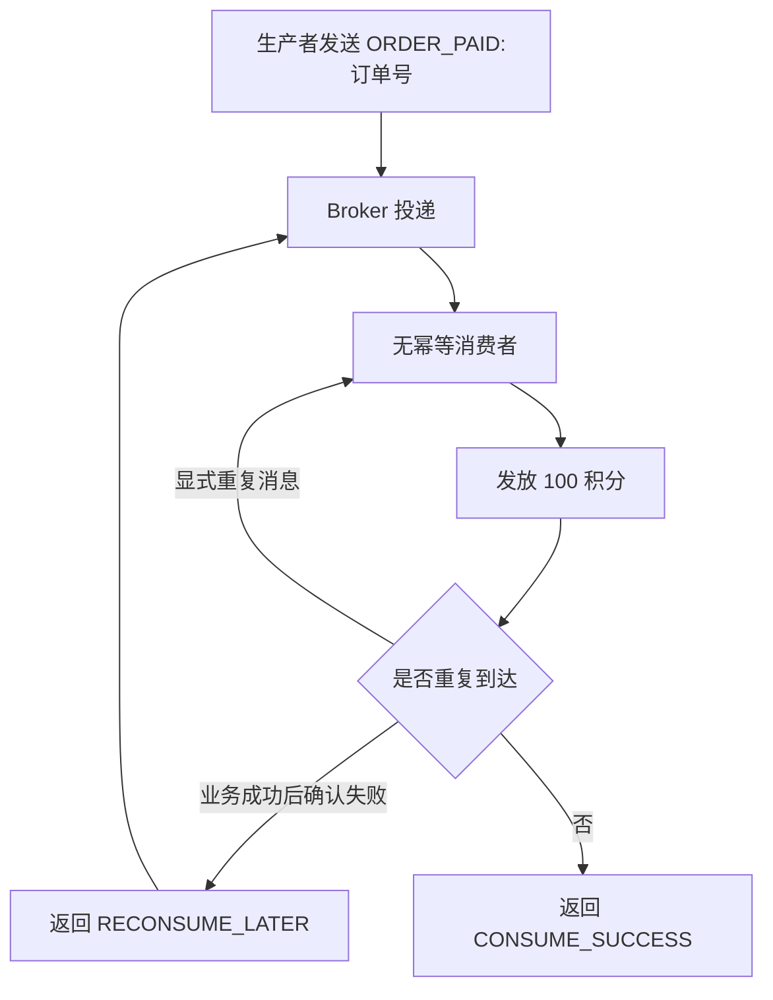
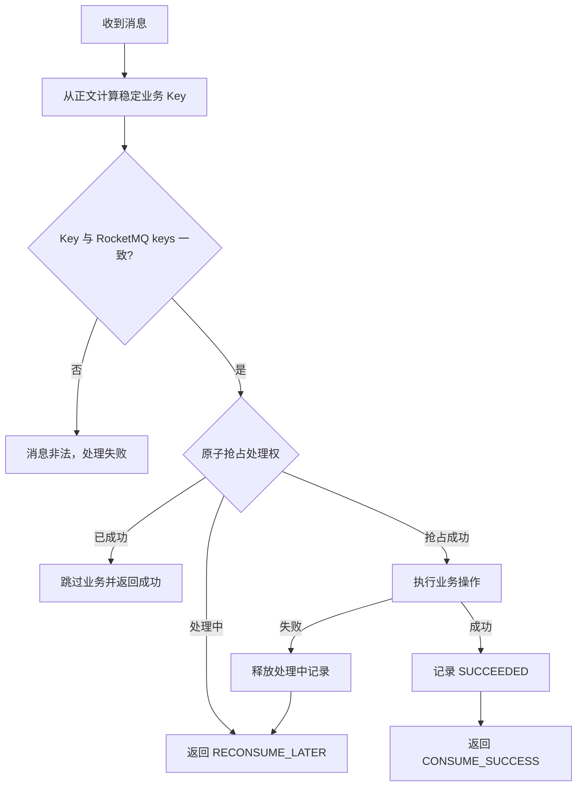

# 07 RocketMQ 重复消费与消费幂等

## 学习目标与边界

本章使用 RocketMQ Client 4.9.2 和纯 Java 演示：

1. `CLUSTERING` 只保证同组消费者正常情况下分摊消息，不保证业务绝不重复执行。
2. 相同业务消息显式重复发送时，无幂等消费者会重复发放积分。
3. 业务成功后返回 `RECONSUME_LATER` 时，Broker 重投会再次触发业务。
4. 幂等消费者使用稳定业务 Key，使相同业务消息多次到达时只执行业务一次。
5. 幂等检查、业务处理和结果记录由不同职责对象承担。
6. 对比内存、数据库唯一约束、Redis、状态机和布隆过滤器方案。
7. 理解幂等记录和业务操作为什么必须保证事务一致性。

**本章不集成 Spring Boot，不引入数据库、Redis、Hutool 或其他非必要依赖。内存去重实现只用于观察流程，不是生产方案。**

## 模块结构

```text
idempotency/
├── config/
│   └── IdempotencyConfig.java                  # NameServer、Topic、组名和重试配置
├── consumer/
│   ├── NonIdempotentConsumer.java              # 每次投递都执行积分发放
│   └── IdempotentConsumer.java                 # 相同业务 Key 只执行一次
├── model/
│   ├── OrderPaidEvent.java                     # 订单支付事件与稳定业务 Key
│   ├── ClaimResult.java                        # 幂等处理权抢占结果
│   └── ProcessingResult.java                   # 幂等消息处理结果
├── producer/
│   └── DuplicateMessageProducer.java           # 显式重复与失败重试场景生产者
├── repository/
│   ├── IdempotencyRecordRepository.java        # 幂等记录职责抽象
│   └── InMemoryIdempotencyRecordRepository.java# 演示用并发安全内存实现
├── service/
│   ├── OrderRewardService.java                 # 模拟积分发放业务副作用
│   └── IdempotentMessageProcessor.java         # 检查、处理、记录的流程编排
└── support/
    ├── ConsumerLifecycle.java                  # 消费者生命周期
    └── MessageSupport.java                     # 消息构建、解析与日志
```

## 为什么 `CLUSTERING` 仍可能重复消费

`CLUSTERING` 的含义是：同一个消费者组内，队列在消费者实例之间分配，同一条消息正常情况下由组内一个实例处理。它解决的是组内负载分摊，不是端到端的“恰好一次业务执行”。

RocketMQ 的消费确认和业务操作不是天然的同一个原子事务，因此存在以下重复窗口：

1. **业务成功但消费进度尚未提交。** 消费者完成扣款、发券或积分发放后，在返回成功或 Broker 记录消费进度前宕机，恢复后消息会再次投递。
2. **消费者上线、下线触发再均衡。** 队列换给新实例时，新实例从 Broker 已保存的 offset 开始消费；旧实例已经完成但尚未提交的消息可能再次执行。
3. **消费失败重试。** Listener 返回 `RECONSUME_LATER` 时消息会重新投递。如果失败发生在部分业务副作用完成之后，重试会再次触发这些副作用。
4. **批量回调部分失败。** 回调收到 `[A, B, C]`，A 已成功、B 失败时，只能返回整批成功或整批失败，无法用一个返回值表达每条消息的不同结果。整批重投后 A 可能再次执行。
5. **生产者发送结果不确定。** Broker 已保存消息但生产者未收到成功响应时，生产者或上游业务可能重发，形成业务 Key 相同但 `msgId` 不同的两条消息。
6. **人工重置 offset 或消息重投。** 运维恢复和补偿操作也可能让历史消息再次到达。

顺序消费比并发消费约束更严格，但队列锁、业务执行和 offset 提交仍不是一个跨系统原子事务，极端情况下同样需要幂等。

不同消费者组都订阅同一 Topic 时，每个组各自获得一份消息，这是订阅模型的正常行为。是否算“业务重复”，取决于这些组是否错误地执行了相同业务副作用。

## 为什么不用 `msgId` 作为唯一方案

本章把业务唯一 Key 定义为：

```text
ORDER_PAID:<订单号>
```

例如订单 `ORDER-20260715-001` 的 Key 始终是：

```text
ORDER_PAID:ORDER-20260715-001
```

显式发送两次时，RocketMQ 会产生两个不同的 `msgId`，但两条消息表达的是同一笔“订单支付完成”业务。**==若只按 `msgId` 去重，这两条消息都会被当成新业务执行。==**

稳定业务 Key 应满足：

- 从业务事实中确定性计算，相同业务重发时不变化。
- 包含业务类型，避免不同事件仅凭订单号发生冲突。
- ==在业务语义上确实唯一，例如支付流水号、退款单号或“订单号 + 事件类型”。==
- ==由生产者和消费者共同约定，并校验 Key 与消息正文一致。==

## 无幂等保护流程



**==无幂等消费者不检查业务 Key。相同业务消息到达两次时，日志中的执行次数和累计积分都会增长两次。==**

## 幂等消费者流程



职责分工如下：

- `IdempotencyRecordRepository`：负责原子抢占、成功状态记录和失败释放。
- `OrderRewardService`：只负责积分发放业务，不感知 RocketMQ 和去重容器。
- `IdempotentMessageProcessor`：编排“幂等检查 → 业务处理 → 结果记录”。
- `IdempotentConsumer`：负责 RocketMQ 消息解析及消费结果转换。

内存仓储使用 `ConcurrentHashMap.putIfAbsent` 原子抢占，而不是 `containsKey` 后再 `put`。后者在并发消费时可能让两个线程同时通过检查并重复执行业务。

## 批量部分失败为什么危险

假设一次 Listener 回调收到三条消息：

```text
A：积分发放成功
B：调用账户服务失败
C：尚未处理
Listener：返回 RECONSUME_LATER
```

RocketMQ 看到的是批次级失败。这批消息重新投递后，A 可能再次执行。即使每次 Producer 调用发送的是单条消息，PushConsumer 的 Listener 参数仍是 `List<MessageExt>`，业务代码不能假设永远只有一条。

**==本章的 `retry` 场景使用更稳定、可观察的方式复现同一风险==**：先完成业务，再故意返回 `RECONSUME_LATER`。它与“批次中前面的消息已成功、后面的消息失败”具有相同本质，即业务副作用已发生，但本次消费没有整体确认成功。

批量处理建议：

1. 每条消息都用自己的稳定业务 Key 执行幂等处理。
2. 记录每条业务消息的成功状态，不用一个批次号代替每条消息的身份。
3. 任一消息失败导致整批重投时，**==已成功消息通过幂等记录快速跳过==**。
4. 不要为了避免重试而在业务失败时错误返回 `CONSUME_SUCCESS`。

## 幂等方案选型

| 方案 | 适用范围 | 主要优点 | 风险与限制 |
| --- | --- | --- | --- |
| 进程内存 | 单进程学习、短期缓存、可容忍丢失的辅助去重 | 简单、延迟低 | 重启丢失，多实例不共享，容量受限，无法与数据库业务事务一致 |
| 数据库唯一约束 | 订单、支付、退款、发券等强一致业务 | 唯一约束可抗并发，可与业务写入同一事务 | 需要设计唯一索引、状态和归档策略；热点 Key 可能造成锁竞争 |
| Redis | 多实例共享、允许设置去重窗口、吞吐较高的场景 | 原子命令、TTL、访问快 | Redis 与业务数据库通常不是同一事务；先写 Redis 或先写数据库都存在故障窗口；过期后可能再次执行 |
| 业务状态机 | 订单、支付、工单等有明确状态迁移的业务 | 直接利用业务条件更新，如 `PAID -> REWARDED`，语义清晰 | 必须校验合法迁移并处理并发；状态设计不完整会误跳过或重复执行 |
| 布隆过滤器 | 超大规模数据的前置快速判重、缓存穿透保护 | 空间小、查询快 | 有假阳性，可能把未处理消息误判为已处理；难删除；不能单独承担资金、库存等强一致幂等 |

布隆过滤器适合做“前置筛选”，不能证明元素一定存在。对不能接受漏处理的业务，应在布隆过滤器判断之后或旁路中使用数据库唯一约束等权威记录。

## 事务一致性是生产实现的核心

本章内存 Demo 的调用顺序是：

```text
创建 PROCESSING 记录 → 发放积分 → 标记 SUCCEEDED
```

它便于学习职责，但内存记录和真实业务数据库无法组成事务，存在两个关键故障窗口：

1. **业务成功，成功记录失败。** RocketMQ 重试后看不到成功记录，业务再次执行。
2. **成功记录先落库，业务随后失败。** 重试看到已成功记录而跳过，造成业务漏处理。

生产中**==如果幂等记录和业务数据位于同一数据库，应把它们放进同一个本地事务，并用唯一约束解决并发：==**

```text
BEGIN
  INSERT INTO mq_consume_record(business_key, status)
  -- business_key 建立唯一索引，重复插入表示已处理或正在处理

  UPDATE user_account
     SET reward_points = reward_points + 100
   WHERE user_id = ?

  UPDATE mq_consume_record
     SET status = 'SUCCEEDED'
   WHERE business_key = ?
COMMIT
```

如果业务横跨多个系统，单机事务不能覆盖全部副作用，需要结合业务状态机、事务消息、Outbox、补偿任务或对端幂等接口设计，不能只靠 Redis `SETNX` 宣称“恰好一次”。

## 前置条件

- NameServer 默认地址：`127.0.0.1:9876`。
- Broker 已注册到 NameServer。
- Broker 开启 `autoCreateTopicEnable=true`，或已创建 `StudyDuplicateConsumptionTopic`。
- 本机能够访问 Broker 注册的 `brokerIP1`。
- 使用 RocketMQ Client 4.9.2，不需要 Spring Boot。

可通过 JVM 系统属性或环境变量覆盖配置：

```text
-Drocketmq.namesrvAddr=127.0.0.1:9876
-Drocketmq.idempotency.topic=StudyDuplicateConsumptionTopic
-Drocketmq.idempotency.producerGroup=duplicate-demo-producer-group
-Drocketmq.idempotency.nonIdempotentGroup=non-idempotent-consumer-group
-Drocketmq.idempotency.idempotentGroup=idempotent-consumer-group
-Drocketmq.idempotency.maxReconsumeTimes=2
```

## IDEA 运行顺序

### 场景一：显式发送两条相同业务消息

1. 在 IDEA 中打开 `NonIdempotentConsumer`，运行 `main` 方法。
2. 打开 `IdempotentConsumer`，运行 `main` 方法。
3. 打开 `DuplicateMessageProducer` 的 Run Configuration，把 Program arguments 设置为：

```text
duplicate ORDER-20260715-101
```

4. 运行生产者，分别观察两个消费者窗口。

生产者发送两次时业务 Key 相同，`msgId` 不同。无幂等消费者执行两次；幂等消费者只执行一次。

### 场景二：业务成功后确认失败触发重试

1. 停止并重新启动两个消费者，清空演示用进程内计数和内存幂等记录。
2. 将 `DuplicateMessageProducer` 的 Program arguments 改为：

```text
retry ORDER-20260715-102
```

3. 运行生产者。
4. 首次投递完成业务后，消费者故意返回 `RECONSUME_LATER`。
5. 等待 Broker 按重试延迟再次投递，观察 `reconsumeTimes=1` 的日志。

无幂等消费者在重试时再次发放积分；幂等消费者发现 `SUCCEEDED` 记录后跳过业务并返回成功。

### Maven 命令等价运行方式

消费者是长驻进程，建议分别打开终端：

```powershell
mvn -q -pl 07-rocketmq-duplicate-consumption-and-idempotency exec:java `
  -Dexec.mainClass=com.example.rocketmqstudy.idempotency.consumer.NonIdempotentConsumer
```

```powershell
mvn -q -pl 07-rocketmq-duplicate-consumption-and-idempotency exec:java `
  -Dexec.mainClass=com.example.rocketmqstudy.idempotency.consumer.IdempotentConsumer
```

显式重复场景：

```powershell
mvn -q -pl 07-rocketmq-duplicate-consumption-and-idempotency exec:java `
  -Dexec.mainClass=com.example.rocketmqstudy.idempotency.producer.DuplicateMessageProducer `
  -Dexec.args="duplicate ORDER-20260715-101"
```

消费重试场景：

```powershell
mvn -q -pl 07-rocketmq-duplicate-consumption-and-idempotency exec:java `
  -Dexec.mainClass=com.example.rocketmqstudy.idempotency.producer.DuplicateMessageProducer `
  -Dexec.args="retry ORDER-20260715-102"
```

## 预期日志

### 显式重复消息的生产者

```text
发送完成：scenario=duplicate, sequence=1, businessKey=ORDER_PAID:ORDER-20260715-101, msgId=...
发送完成：scenario=duplicate, sequence=2, businessKey=ORDER_PAID:ORDER-20260715-101, msgId=...
```

两行 `businessKey` 相同，`msgId` 不同，说明 `msgId` 不能识别“不同 RocketMQ 消息表达同一业务”的情况。

### 无幂等保护消费者

```text
topic=StudyDuplicateConsumptionTopic, tag=ExplicitDuplicate, businessKey=ORDER_PAID:ORDER-20260715-101, msgId=..., reconsumeTimes=0
发放积分：orderNumber=ORDER-20260715-101, userId=USER-1001, points=100, 执行次数=1, 累计积分=100
topic=StudyDuplicateConsumptionTopic, tag=ExplicitDuplicate, businessKey=ORDER_PAID:ORDER-20260715-101, msgId=..., reconsumeTimes=0
发放积分：orderNumber=ORDER-20260715-101, userId=USER-1001, points=100, 执行次数=2, 累计积分=200
```

### 幂等消费者

```text
发放积分：orderNumber=ORDER-20260715-101, userId=USER-1001, points=100, 执行次数=1, 累计积分=100
幂等处理成功并记录结果：ORDER_PAID:ORDER-20260715-101
检测到已成功的业务 Key，跳过重复业务：ORDER_PAID:ORDER-20260715-101
```

### 消费失败重试

无幂等保护消费者：

```text
..., tag=RetryAfterSuccess, ..., reconsumeTimes=0
发放积分：..., 执行次数=1, 累计积分=100
业务已成功，但模拟进程异常/确认失败，返回 RECONSUME_LATER
..., tag=RetryAfterSuccess, ..., reconsumeTimes=1
发放积分：..., 执行次数=2, 累计积分=200
```

幂等消费者：

```text
..., tag=RetryAfterSuccess, ..., reconsumeTimes=0
发放积分：..., 执行次数=1, 累计积分=100
幂等处理成功并记录结果：ORDER_PAID:ORDER-20260715-102
业务与幂等记录已成功，但模拟确认失败，返回 RECONSUME_LATER
..., tag=RetryAfterSuccess, ..., reconsumeTimes=1
检测到已成功的业务 Key，跳过重复业务：ORDER_PAID:ORDER-20260715-102
```

实际重试间隔由 Broker 的延迟级别控制，不会立即连续打印。

## 注意点

1. 本章内存记录随进程重启全部丢失；重启幂等消费者后再次发送旧订单，业务会重新执行。
2. 多个消费者进程各有自己的内存 Map，无法提供集群级幂等。
3. `putIfAbsent` 只解决当前 JVM 内并发抢占，**不解决内存记录与业务数据库的事务一致性**。
4. 业务 Key 必须稳定。不要在每次发送时重新生成 UUID 作为同一业务的身份。
5. **`msgId` 适合排查 RocketMQ 消息轨迹，但不能替代业务唯一 Key。**
6. 看到 `ALREADY_PROCESSING` 时本例返回稍后重试，**避免直接确认后丢失正在失败的业务**。
7. **==幂等记录不能无限增长==**。生产中要根据业务追溯期设计分区、归档和清理策略，但清理后旧消息重投可能再次执行。
8. **==Redis TTL 必须覆盖消息最大重试、延迟、补偿和人工重投周期；否则 Key 过期后仍可能重复执行。==**
9. 布隆过滤器有假阳性，不能单独用于资金、库存、权益发放等不允许漏处理的业务。
10. 消费失败时不要为了停止重复而返回 `CONSUME_SUCCESS`；应先保证业务幂等，再让 RocketMQ 正常重试。
11. 反复练习时使用新的订单号。若沿用同一消费者组，还要注意 Broker 中历史消费进度。
12. 本章故意把“业务成功后确认失败”作为风险演示；真实代码不能主动制造该返回值。

## 复习问题

### 1. 为什么 `CLUSTERING` 不能保证业务只执行一次？

`CLUSTERING` 保证的是同一个消费者组内的消费者实例共同分摊队列。正常情况下，一个队列同一时刻只分配给组内一个消费者实例，一条消息也只交给其中一个实例处理，但这不等于业务一定只执行一次。

**==业务操作与消费确认、offset 提交不是一个原子事务。==**如果积分已经发放，但消费者在返回成功前宕机、网络中断，或者 Broker 没有记录到新的消费进度，该消息仍可能被重新投递。消费重试、再均衡、生产者重发和人工重置 offset 等情况也可能造成相同业务再次执行。因此，`CLUSTERING` 解决的是负载分摊，不是业务层面的“恰好一次”。

### 2. 消费者再均衡时，业务执行与 offset 提交之间有什么重复窗口？

旧消费者可能已经完成业务操作，但新的 offset 还没有成功提交给 Broker。此时消费者上线、下线或发生网络抖动，触发队列重新分配，新消费者会从 Broker 当前保存的旧 offset 开始消费。由于 Broker 不知道旧消费者已经完成了业务，新消费者可能再次处理同一条消息。

正常情况下，已经成功提交的 offset 会保存在 Broker 中，相同消费者组重启后会从该位置继续消费，而不是重新读取全部历史消息。但这只能避免已经确认成功的消息被正常重放，不能消除“业务已完成、offset 尚未提交”这个短暂窗口。

### 3. 为什么相同业务消息可能拥有不同的 RocketMQ `msgId`？

`msgId` 标识的是一条具体的 RocketMQ 消息，不直接标识业务。如果生产者发送结果不确定、上游执行补偿，或者像本章 Demo 一样主动发送两次，同一笔订单业务会被创建为多条 RocketMQ 消息，每次发送都可能获得不同的 `msgId`。

消息被分配到哪个 Queue 不是产生不同 `msgId` 的根本原因。根本原因是同一业务事实被重新创建并发送成了新的 MQ 消息。因此需要使用 `ORDER_PAID:订单号` 这类稳定业务 Key 识别业务身份，`msgId` 主要用于查询消息轨迹和排查投递问题。

### 4. 一个合格的业务唯一 Key 应满足哪些条件？

业务 Key 应在业务语义上唯一，并且能够从稳定的业务事实中确定性生成。同一业务无论发送或重试多少次，Key 都不能变化；不同业务也不能错误地得到同一个 Key。

例如本章使用 `ORDER_PAID:订单号`，其中事件类型用于区分不同业务动作，订单号用于定位具体订单。生产者和消费者还应共同约定 Key 的生成规则，并校验消息 Key 与消息正文表达的业务身份一致。不要在每次发送时重新生成随机 UUID 作为同一业务的 Key。

### 5. 为什么 `containsKey` 后再 `put` 不能防止并发重复处理？

`containsKey` 和 `put` 是两个独立操作，不具备原子性。两个线程可能同时执行 `containsKey`，都发现 Key 不存在，然后分别执行 `put` 并继续处理业务，最终造成业务执行两次。

本章使用 `ConcurrentHashMap.putIfAbsent` 原子地抢占处理权，使同一 JVM 中只有一个线程能把业务 Key 从不存在变为 `PROCESSING`。生产环境则通常依靠数据库唯一约束、条件更新或 Redis 原子命令完成跨实例抢占。

### 6. 批量回调中 A 成功、B 失败时，A 为什么可能再次执行？

RocketMQ Listener 返回的是整个回调批次的消费结果，不能用一个返回值表达“A 成功、B 失败、C 尚未处理”。当 B 失败并返回 `RECONSUME_LATER` 时，Broker 可能重新投递这一批消息，已经处理过的 A 也会再次到达消费者。

这里不是数据库事务把 A 的业务操作自动回滚了。A 已经产生的积分发放、扣库存等副作用通常仍然存在；如果没有按 A 自己的业务 Key 做幂等，重新投递时就会再次执行 A。

### 7. 数据库唯一约束为什么通常比进程内存更适合生产幂等？

数据库可以被多个消费者实例共享，数据不会因为某个消费者进程重启而丢失，唯一索引还可以在数据库层面阻止多个实例同时插入同一个业务 Key。相比之下，进程内 Map 只对当前 JVM 有效，重启后丢失，多实例之间也互相不可见。

不过，只有唯一约束还不够。通常要先通过唯一业务 Key 抢占处理权，再把幂等记录和业务数据修改放进同一个本地事务。这样才能同时避免“幂等记录成功但业务失败”和“业务成功但幂等记录失败”。如果业务只是简单地执行 `积分 = 积分 + 100`，却没有使用幂等记录控制是否允许执行，即使数据库本身数据一致，也仍然可能多加一次积分。

### 8. Redis `SETNX` 与业务数据库更新之间有哪些故障窗口？

Redis 和业务数据库通常不在同一个本地事务中，因此执行顺序无论如何安排都可能出现状态不一致：

- 先执行 Redis `SETNX`，再更新数据库：Redis 已记录成功，但数据库更新失败。重试时看到 Redis Key 已存在，会跳过尚未完成的业务。
- 先更新数据库，再写 Redis：数据库业务已经成功，但 Redis 写入失败。重试时查询不到 Key，可能再次执行业务。
- Redis Key 过期、被淘汰或发生数据丢失：历史消息再次到达时，会被当作新业务处理。

因此 Redis 适合原子抢占、共享去重窗口或性能优化，但不能天然保证它与业务数据库之间的事务一致性。

### 9. 为什么布隆过滤器不能单独保护积分、库存或资金业务？

布隆过滤器能够可靠地判断“某个元素一定不存在”，但当它返回“可能存在”时，元素不一定真的存在，这称为假阳性。

如果一笔从未处理过的订单被误判为“可能已经处理”，消费者直接跳过，就会造成积分未发放、库存未扣减或资金业务漏处理。强一致业务不能接受这种漏处理，因此布隆过滤器只能作为前置快速筛选，后面仍需数据库唯一记录等权威数据源进行确认。

### 10. “业务成功但幂等记录失败”和“幂等记录成功但业务失败”分别会造成什么后果？

- 业务成功但幂等记录失败：业务副作用已经发生，但系统没有留下成功标记。消息重新投递时，消费者查询不到成功记录，可能再次执行业务，造成重复发放或重复扣减。
- 幂等记录成功但业务失败：系统已经记录该业务完成，但真正的业务操作没有成功。即使 RocketMQ 重新投递，消费者也可能因为看到成功记录而跳过，造成业务漏处理。

幂等记录不等于 Broker offset。Broker 是否重新投递由消费确认和 offset 决定；重投以后是否再次执行业务由幂等记录决定。核心解决办法是尽量让幂等记录和业务操作处于同一个本地事务中。

### 11. 状态机如何把重复命令转换为无副作用的重复请求？

状态机为业务规定合法的状态迁移，例如订单只能从 `PAID` 迁移到 `REWARDED`。消费者通过带状态条件的更新执行迁移：

```sql
UPDATE orders
SET status = 'REWARDED'
WHERE order_no = ? AND status = 'PAID';
```

第一次处理会成功修改一行；相同命令再次到达时，订单已经是 `REWARDED`，条件不成立，影响行数为零，不会再次产生状态变化。业务仍需结合事务和并发控制，保证状态迁移与积分发放等副作用保持一致。

### 12. 跨系统业务无法放入一个本地事务时，还需要哪些可靠性机制？

仅使用 Redis 这样的全局共享状态不能解决跨系统原子性，因为 Redis、业务数据库和下游系统仍可能分别成功或失败。实际方案需要根据业务要求组合使用：

- 每个系统自己的数据库唯一约束和本地事务。
- 下游接口基于业务 Key 实现幂等。
- 业务状态机和条件更新。
- RocketMQ 事务消息或本地消息表（Outbox），保证本地业务与事件发送的一致性。
- 补偿任务、对账、重试和人工处理，保证最终一致性。
- 对极少数确实需要强一致的场景，再评估分布式事务及其性能、可用性成本。

核心不是寻找一个“全局 Map”，而是让每个系统都能识别重复请求、可靠记录本地结果，并在部分失败后重试或补偿。
