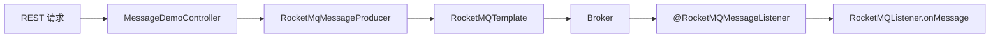
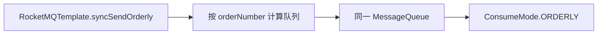
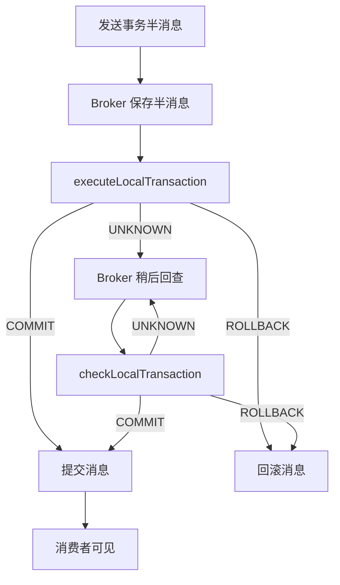

# 08 RocketMQ 集成 Spring Boot

## 学习目标与边界

本章在前七章纯 Java RocketMQ Client 学习基础上，使用 Spring Boot 2.7.18 和 RocketMQ Spring 2.2.3 演示：

1. 通过 `application.yml` 配置 NameServer、生产者组、Topic 和消费者组。
2. 使用 `RocketMQTemplate` 发送同步、异步、单向、延迟、对象、顺序和事务消息。
3. 使用 `@RocketMQMessageListener` 声明消费者，不再手工创建和启动 `DefaultMQPushConsumer`。
4. 使用 Spring 消息转换器发送和接收 JSON 订单对象。
5. 使用 `topic:tag` 发送 Tag 消息，并在消费者端配置 Tag 过滤表达式。
6. 对比 `CLUSTERING` 集群模式和 `BROADCASTING` 广播模式。
7. 理解事务半消息、本地事务状态和 Broker 回查之间的关系。

本章的重点是 **Spring Boot 如何装配和使用 RocketMQ 客户端**。第五章已经详细演示消息模式，第六、七章已经讨论重试、死信和消费幂等，因此本章不会重新实现这些底层机制。

**本章不引入数据库。事务消息状态使用进程内 Map 只是为了观察回查流程，不能作为生产事务依据。**

## 为什么选择这些版本

| 组件 | 版本 | 说明 |
| --- | --- | --- |
| Java | 17 | 与根项目 Maven 编译配置一致 |
| Spring Boot | 2.7.18 | 支持 Java 17，仍使用 `javax.validation` 体系 |
| RocketMQ Spring | 2.2.3 | 与 RocketMQ 4.x 客户端学习路线匹配 |

原始学习文档使用 Spring Boot 2.6.3 和 RocketMQ Spring 2.0.2。本章保留文档中的核心 API 和学习场景，但不照搬旧工程结构、Lombok 和测试类发送方式。

## 模块结构

```text
springboot/
├── RocketMqSpringBootApplication.java          # Spring Boot 应用入口
├── config/
│   └── StudyRocketMqProperties.java            # Topic 与消费者组集中配置
├── controller/
│   ├── MessageDemoController.java              # 触发消息发送的 REST 接口
│   └── DemoExceptionHandler.java               # 参数错误统一处理
├── model/
│   ├── ApiErrorResponse.java                   # REST 错误响应
│   ├── SendMessageRequest.java                 # 字符串消息请求
│   ├── OrderMessage.java                       # JSON 订单消息
│   └── TransactionScenario.java                # 本地事务演示场景
├── producer/
│   └── RocketMqMessageProducer.java            # RocketMQTemplate 发送封装
├── consumer/
│   ├── SimpleMessageListener.java              # 字符串消息监听器
│   ├── OrderMessageListener.java               # JSON 对象消息监听器
│   ├── TagMessageListener.java                 # Tag 过滤监听器
│   ├── OrderlyMessageListener.java             # 顺序消息监听器
│   ├── TransactionMessageConsumer.java         # 已提交事务消息监听器
│   ├── ClusteringMessageListener.java          # 集群消费模式监听器
│   └── BroadcastingMessageListener.java        # 广播消费模式监听器
└── transaction/
    ├── LocalTransactionService.java            # 本地事务执行与状态记录
    └── TransactionMessageListener.java         # 本地事务回调与 Broker 回查
```

## Spring Boot 集成流程



Spring Boot 启动时，RocketMQ Starter 会读取 `rocketmq.*` 配置并创建 `RocketMQTemplate`。同时，它会扫描带有 `@RocketMQMessageListener` 的 Spring Bean，为每个监听器创建和启动对应的消费者容器。

应用代码只需要关注：

- 生产端选择哪个 `RocketMQTemplate` 方法。
- 消费端监听哪个 Topic、消费者组以及过滤条件。
- 消息转换后的业务对象如何处理。

## 核心配置

`application.yml` 中的客户端配置：

```yaml
rocketmq:
  name-server: ${ROCKETMQ_NAMESRV_ADDR:127.0.0.1:9876}
  producer:
    group: ${ROCKETMQ_PRODUCER_GROUP:spring-boot-study-producer-group}
    send-message-timeout: 3000
    retry-times-when-send-failed: 2
    retry-times-when-send-async-failed: 2
    max-message-size: 4194304
```

`study.rocketmq.*` 保存本章的 Topic 和消费者组。监听器注解通过占位符引用配置，例如：

```java
@RocketMQMessageListener(
        topic = "${study.rocketmq.simple-topic}",
        consumerGroup = "${study.rocketmq.simple-consumer-group}")
```

Topic 表示消息类别，消费者组表示一组具有相同消费职责和消费进度的消费者。不要因为两个监听器处理的 Java 类型相同，就随意让它们共用消费者组。

## 前置条件

- JDK 17 和 Maven 已安装。
- NameServer 默认地址为 `127.0.0.1:9876`。
- Broker 已注册到 NameServer。
- Broker 开启 `autoCreateTopicEnable=true`，或已提前创建本章配置的 Topic。
- 本机能够访问 Broker 注册的 `brokerIP1`。
- RocketMQ 4.x Broker 已配置事务消息回查所需的正常运行环境。

如 NameServer 不在本机，可设置环境变量：

```powershell
$env:ROCKETMQ_NAMESRV_ADDR = "192.168.1.20:9876"
```

## 启动应用

在项目根目录执行：

```powershell
mvn -q -pl 08-rocketmq-spring-boot-integration spring-boot:run
```

默认 HTTP 端口为 `8080`。也可以先构建再运行：

```powershell
mvn -q -pl 08-rocketmq-spring-boot-integration package
java -jar 08-rocketmq-spring-boot-integration/target/08-rocketmq-spring-boot-integration-1.0.0-SNAPSHOT.jar
```

应用启动时会同时启动生产者和所有声明式消费者，因此必须先保证 NameServer 和 Broker 可用。

## REST 演示接口

以下命令使用 Windows 的 `curl.exe`，避免 PowerShell 将 `curl` 解释为其他命令。

### 同步消息

```powershell
curl.exe -X POST "http://localhost:8080/api/messages/sync" `
  -H "Content-Type: application/json" `
  -d '{"message":"同步订单通知"}'
```

同步发送会等待 Broker 返回结果。接口响应包含 `sendStatus` 和 `msgId`。

### 异步消息

```powershell
curl.exe -X POST "http://localhost:8080/api/messages/async" `
  -H "Content-Type: application/json" `
  -d '{"message":"异步审计日志"}'
```

HTTP 请求只表示异步发送任务已经提交。最终成功或失败结果由 `SendCallback` 输出到应用日志。

### 单向消息

```powershell
curl.exe -X POST "http://localhost:8080/api/messages/one-way" `
  -H "Content-Type: application/json" `
  -d '{"message":"非关键埋点日志"}'
```

单向发送不等待 Broker 确认，吞吐较高，但调用方不能从返回值确认消息是否成功保存，不适合资金、库存等重要业务。

### 延迟消息

```powershell
curl.exe -X POST "http://localhost:8080/api/messages/delay?delayLevel=4" `
  -H "Content-Type: application/json" `
  -d '{"message":"30 秒后检查未支付订单"}'
```

RocketMQ 4.x 使用固定延迟等级，本例允许 `1` 到 `18`：

```text
1s 5s 10s 30s 1m 2m 3m 4m 5m 6m 7m 8m 9m 10m 20m 30m 1h 2h
```

等级 `4` 对应约 30 秒。实际投递时间还会受到 Broker 调度影响。

### JSON 对象消息

```powershell
curl.exe -X POST "http://localhost:8080/api/messages/orders" `
  -H "Content-Type: application/json" `
  -d '{"orderNumber":"ORDER-20260716-001","userId":"USER-1001","status":"PAID","sequence":1}'
```

生产端发送 `OrderMessage` 对象，RocketMQ Spring 消息转换器将其序列化；消费端使用 `RocketMQListener<OrderMessage>` 接收反序列化后的对象。生产者和消费者必须对字段名称、类型和兼容策略达成一致。

### 顺序消息

```powershell
curl.exe -X POST "http://localhost:8080/api/messages/orders/lifecycle?orderNumber=ORDER-20260716-002&userId=USER-1002"
```

生产端按以下顺序发送：

```text
CREATED -> PAID -> SHIPPED -> RECEIVED
```



`syncSendOrderly` 的第三个参数是队列选择键。本例使用订单号，保证同一订单的消息进入同一队列。它只能保证 **同一选择键、同一队列中的消息顺序**，不能保证整个 Topic 的所有订单形成全局顺序。

### Tag 过滤

监听器表达式只接受 `java || spring`：

```powershell
curl.exe -X POST "http://localhost:8080/api/messages/tagged?tag=java" `
  -H "Content-Type: application/json" `
  -d '{"message":"Java 技术消息"}'
```

若改为 `tag=python`，Broker 会保存消息，但本章的 Tag 监听器不会收到它。

`RocketMQTemplate` 使用 `Topic:Tag` 形式指定目标，例如：

```text
StudySpringBootTagTopic:java
```

Tag 适合对一个 Topic 内的消息做轻量分类。Key 更适合标识业务身份、查询轨迹和实现业务幂等，不应混淆二者。

## 事务消息

事务消息发送接口：

```powershell
curl.exe -X POST "http://localhost:8080/api/messages/transaction?scenario=commit" `
  -H "Content-Type: application/json" `
  -d '{"message":"订单支付事件"}'
```

支持三种场景：

| 场景参数 | 首次本地事务状态 | 消费者是否可见 |
| --- | --- | --- |
| `commit` | `COMMIT` | 可见 |
| `rollback` | `ROLLBACK` | 不可见 |
| `unknown_then_commit` | 首次 `UNKNOWN`，回查返回 `COMMIT` | 回查提交后可见 |

流程如下：



生产实现不能只在内存中保存事务状态。回查必须查询可恢复、可信的业务数据，例如订单数据库中的本地事务记录。

**运行 `unknown_then_commit` 时建议只启动一个应用实例。** 本章状态 Map 不在实例间共享；如果 Broker 向另一个实例发起回查，该实例找不到状态并会返回 `UNKNOWN`。这正说明生产事务状态必须持久化。

## 集群模式与广播模式

先在两个终端启动不同端口的应用实例：

```powershell
mvn -q -pl 08-rocketmq-spring-boot-integration spring-boot:run `
  -Dspring-boot.run.arguments="--server.port=8080"
```

```powershell
mvn -q -pl 08-rocketmq-spring-boot-integration spring-boot:run `
  -Dspring-boot.run.arguments="--server.port=8081"
```

然后发送十条消息：

```powershell
curl.exe -X POST "http://localhost:8080/api/messages/consumer-models?count=10"
```

两个监听器订阅同一个 Topic，但消费者组不同：

- `ClusteringMessageListener`：两个实例属于同一个集群消费者组，十条消息由实例共同分摊。
- `BroadcastingMessageListener`：两个实例属于同一个广播消费者组，每个在线实例都会收到十条消息。

**不同消费者组各自获得一份消息是正常订阅行为，不是 RocketMQ 错误重复投递。** 同一个消费者组内的集群模式才会进行队列分摊。

广播消费的消费进度通常保存在消费者本地，实例离线期间的消息补偿语义与集群模式不同，不应把广播模式用于要求统一消费进度的核心业务。

## 预期日志

简单消息：

```text
简单消息消费者收到：同步订单通知
```

顺序消息：

```text
顺序消费者收到：orderNumber=ORDER-20260716-002, sequence=1, status=CREATED
顺序消费者收到：orderNumber=ORDER-20260716-002, sequence=2, status=PAID
顺序消费者收到：orderNumber=ORDER-20260716-002, sequence=3, status=SHIPPED
顺序消费者收到：orderNumber=ORDER-20260716-002, sequence=4, status=RECEIVED
```

事务回查：

```text
执行本地事务：key=TX-..., scenario=UNKNOWN_THEN_COMMIT, returnedState=UNKNOWN
回查本地事务：key=TX-..., state=COMMIT
事务消息消费者收到已提交消息：订单支付事件
```

消费模式：

```text
集群消费者收到：instancePort=8080, message=消费模式演示消息-1
集群消费者收到：instancePort=8081, message=消费模式演示消息-2
广播消费者收到：instancePort=8080, message=消费模式演示消息-1
广播消费者收到：instancePort=8081, message=消费模式演示消息-1
```

队列分配由 Broker 和客户端再均衡决定，集群模式不能假定严格轮流消费。

## 测试与构建

单元测试使用模拟的 `RocketMQTemplate`，不连接 Broker：

```powershell
mvn -q -pl 08-rocketmq-spring-boot-integration test
```

构建全部章节：

```powershell
mvn -q clean package
```

真实收发、事务回查和多实例消费模式仍需连接 RocketMQ Broker 手工验证。

## 注意点

1. **==`RocketMQTemplate.syncSend` 返回成功只表示消息发送链路获得 Broker 确认，不表示消费者业务已经完成。==**
2. 异步发送必须处理成功和失败回调，应用退出前还要给回调留出执行时间。
3. 单向发送不适合不能接受消息丢失的重要业务。
4. RocketMQ 4.x 延迟消息使用固定等级，不支持任意延迟时间。
5. ==**顺序发送必须让同一业务实体始终使用稳定的队列选择键。**==
6. 顺序消费、集群消费都不能替代第七章讲解的业务幂等。
7. Java 对象消息属于生产者与消费者之间的协议，字段变更需要考虑前后兼容。
8. Tag 在 Broker 端过滤；Key 主要承担业务标识与查询定位职责。
9. 事务消息解决“本地事务与消息发送”的最终一致性，不会自动把远程消费者业务纳入同一个 ACID 事务。
10. 本地事务回查必须以数据库中的真实业务状态为准，不能仅依赖当前 JVM 内存。
11. 多实例使用相同消费者组前，应确保它们的订阅 Topic、Tag 表达式和消费逻辑一致。
12. 生产环境还应配置 ACL、TLS、消息轨迹、监控告警和 Topic 权限，本章不展开部署安全配置。

## 复习问题

### 1. `RocketMQTemplate` 与直接使用 `DefaultMQProducer` 的关系是什么？

`RocketMQTemplate` 是 RocketMQ Spring 提供的上层模板。Starter 根据 Spring Boot 配置创建底层 Producer，并由模板统一完成消息转换、目的地解析和发送调用。它减少了重复生命周期代码，但底层仍然遵循 RocketMQ 的发送确认、重试、Topic、Tag 和队列规则。

### 2. 为什么消费者组不应该随意复用？

同一消费者组内的消费者被视为同一消费职责，共享集群消费进度并分摊队列。如果两个业务完全不同的监听器错误使用同一组，它们可能互相分走消息，造成某类业务没有执行。同组实例应保持订阅和处理逻辑一致。

### 3. 对象消息为什么需要考虑兼容性？

消息可能在 Broker 中保留一段时间，生产者和消费者也可能独立升级。**==生产者增加、删除或改变字段类型时，旧消费者或历史消息可能无法正常反序列化。生产中通常需要稳定事件结构、版本字段和兼容的演进策略。==**

### 4. `UNKNOWN` 为什么不能直接当作 `COMMIT`？

`UNKNOWN` 表示当前无法确认本地事务是否成功。如果直接提交，真实业务回滚时消费者仍会看到消息；如果直接回滚，真实业务已经成功时又会丢失事件。Broker 回查给生产者再次查询权威业务状态的机会。

### 5. 启动两个实例后，为什么广播监听器和集群监听器都会收到消息？

两个监听器属于不同消费者组，因此每个组都有独立订阅。集群组内部的两个实例分摊该组的一份消息；广播组内部的两个实例各自收到该组的一份消息。这是两个维度：先按消费者组复制，再按组内模式决定分摊或广播。
